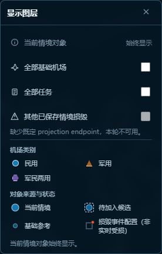
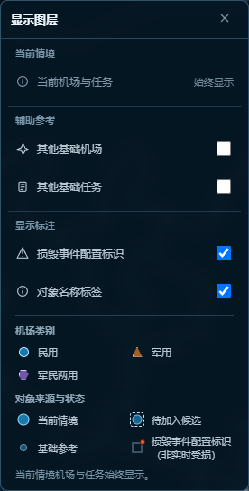

# 情境地图图层面板精简与显示控制验证

## 实施基线与范围

- 分支：`review/minimal-model-r1`
- 实施基线：`3d648b1 fix: attach airport damage configuration badge`
- 本轮只调整图层面板、页面级显示状态、当前对象标签绑定及 fallback 对应表现。
- 未修改机场类别形状/颜色/尺寸、6px 损毁角标规格、Pane 层级、ID 排重、参考层缓存、候选差异更新、后端、数据库或标准数据。

## 修改文件

- `frontend/templates/pages/situations.html`
- `frontend/static/css/situations.css`
- `frontend/static/js/modules/situation-state.js`
- `frontend/static/js/modules/situation-panels.js`
- `frontend/static/js/modules/situation-map.js`
- `tests/frontend/test_situation_layer_scope.py`
- `tests/frontend/test_airport_situation_browser.py`
- `tests/frontend/test_mission_situation_browser.py`
- `tests/frontend/test_situation_lifecycle_browser.py`

## 面板前后对照

修改前保留了不可用的跨情境损毁入口，并使用“全部”命名：

修改后分为“当前情境 / 辅助参考 / 显示标注”三区；当前机场与任务仅作“始终显示”说明，参考层改称“其他基础机场 / 其他基础任务”，删除无效入口及开发提示：

完整页面对照：

- [修改前完整地图](./before-full-map-dpr1.png)
- [修改后完整地图](./after-full-map-dpr1.png)
- [DPR 2 面板](./after-layer-panel-dpr2.png)
- [DPR 2 完整地图](./after-full-map-dpr2.png)

## 两个显示开关

显示偏好只保存在页面 `state`：`showDamageConfig` 与 `showObjectLabels`，默认均为 `true`。切换不修改 working copy、不触发 dirty、不调用保存接口。情境切换保留当前页面偏好；页面卸载并重新进入时沿用现有状态重置机制恢复默认开启。

四种组合均由真实 Chromium 页面采集：

| 损毁配置标识 | 对象名称标签 | 截图 |
| --- | --- | --- |
| 开 | 开 | [查看](./combination-damage-on-labels-on-dpr1.png) |
| 关 | 开 | [查看](./combination-damage-off-labels-on-dpr1.png) |
| 开 | 关 | [查看](./combination-damage-on-labels-off-dpr1.png) |
| 关 | 关 | [查看](./combination-damage-off-labels-off-dpr1.png) |

关闭名称标签不会隐藏 tooltip Pane，也不会为候选或参考对象增加永久标签。重新开启后会重建当前对象标签并重新执行既有碰撞布局。

## 状态与临时对象验证

- 损毁标识偏好关闭时进入损毁编辑模式，角标被临时强制显示：[截图](./damage-mode-forced-visible-dpr1.png)。
- 退出损毁编辑模式后，角标恢复为关闭：[截图](./damage-mode-exit-restored-dpr1.png)。checkbox 偏好在该过程中始终未被改写。
- 名称关闭时，机场聚焦标签仍显示：[截图](./labels-off-focus-preserved-dpr1.png)。
- 名称关闭时，机场正式选中与损毁角标可独立同时显示：[截图](./labels-off-selected-damage-on-dpr1.png)。
- 名称关闭时，任务正式选中标签仍显示：[截图](./labels-off-selected-task-preserved-dpr1.png)。
- 任务来源预览保留必要名称：[截图](./labels-off-mission-source-preview-dpr1.png)。
- 地图临时取点保留“任务临时位置”标签：[截图](./labels-off-mission-location-draft-dpr1.png)。

## Leaflet、fallback 与既有逻辑回归

- Leaflet 与 fallback 均按相同规则控制普通标签和损毁配置角标；fallback 关闭两项显示的证据见[截图](./fallback-damage-off-labels-off.png)。
- 参考机场继续按 `airport_id` 排除当前机场和可见候选，参考任务继续按 `mission_id` 排除当前任务；参考 Marker、Pane、交互及独立缓存未改。
- 任务地图取点期间参考标记保持不可点击，取点完成/取消后恢复。
- 显示开关重绘当前业务标记，但不会清空或重建 `candidateMarkers`；565 个候选的节点身份、筛选和差异更新测试通过。
- 受控测试页的瓦片请求返回 404 属于测试服务器未提供本地瓦片，不构成 JavaScript 页面错误。

## 测试结果

- 静态与视觉契约：37 passed。
- 相关 Chromium 浏览器回归：54 passed。
- 合计：91 passed，0 failed。
- 另有一次证据用例初跑因 Leaflet 已移除 tooltip 的淡出 DOM 仍在过渡期而计数失败；等待既有 300ms 过渡结束后通过，未发现业务缺陷。

本轮不推送、不部署；提交后暂停等待人工验收。
